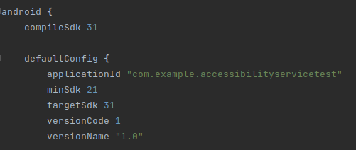
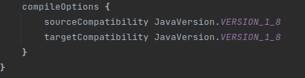
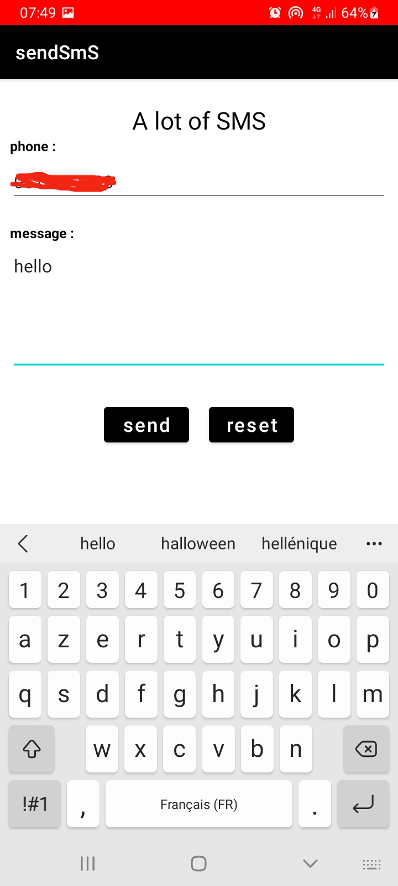
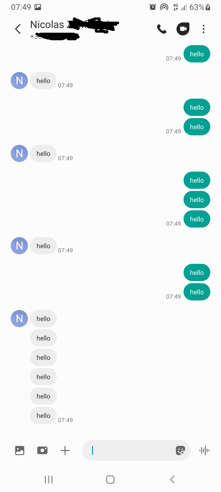

# send-messages-android

send a lot of message

### environement version : 

build.gradle : 

IDE : 

### how to use :

- clone depot
- install app with an IDE
- enter phone and message
- send button
- for stopping send message, close app

image example with my phone : 

